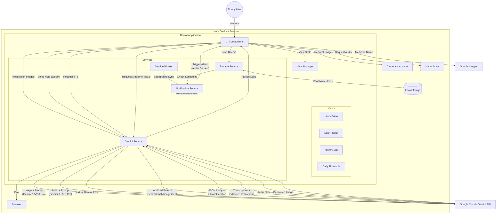

# DawAI Architecture & Design Document

## 1. System Overview

DawAI is a **Client-Side Single Page Application (SPA)** capable of running as a **Progressive Web App (PWA)**. It leverages a "Serverless" approach where the frontend communicates directly with the Google Gemini API for multimodal intelligence (Text, Image, Audio), while persistence and notification logic are handled entirely within the browser via LocalStorage and Service Workers.

## 2. High-Level Architecture Diagram

## 3. Core Services

### A. Gemini Service (`services/geminiService.ts`)
The intelligence layer handles distinct multimodal tasks using a tiered model strategy:
*   **Prescription Analysis (Vision):** Uses `gemini-3-pro-preview`. This higher-tier model is used to decipher complex handwriting and interpret medical intent with high precision, converting it into a structured JSON schema.
    *   *Key Feature:* Explicitly prompts for **verbatim extraction** of clinical advice while providing **transliterated** names and **simplified analogies** for patient understanding.
*   **Voice Note Analysis (Audio):** Uses `gemini-3-pro-preview`. It processes raw audio bytes to transcribe spoken instructions and automatically extract actionable reminders into a machine-readable format.
*   **Contextual Translation:** Uses `gemini-3-pro-preview`. When a user changes language, the entire history is re-processed to ensure clinical instructions match the original intent word-for-word in the new target script.
*   **Text-to-Speech (TTS):** Uses `gemini-2.5-flash-preview-tts`. Specialized model for converting medical summaries into natural-sounding audio using the `Kore` voice profile.
*   **Anatomy Visualization:** Uses `gemini-2.5-flash-image`. Generates localized anatomy diagrams (full-body silhouettes) based on the specific diagnosis extracted by the vision model.

### B. Storage Service (`services/storageService.ts`)
Manages persistence using `localStorage`.
*   **Key:** `sahayak_history_v1`
*   **Data Structure:** Array of `HistoryItem` objects.
*   **Bulk Actions:** Includes a `clearHistory` function for full data wipes.
*   **Optimization:** Implements basic image compression to stay within the browser's 5MB LocalStorage limit.

### C. Notification Service (`services/notificationService.ts`)
Handles medication adherence via PWA standards.
*   **Mechanism:** Runs a polling interval (every 10s) to check `localStorage` schedules against system time.
*   **Delivery:**
    1.  **System Notification:** Uses the Notification API for background alerts.
    2.  **In-App Alarm:** Uses `AudioContext` with an Oscillator node to generate a distinct "beep" sound even if the app is in the foreground, overlaying a high-contrast red alert screen.
    3.  **Dynamic Voice Alarms:** Generates a custom voice reminder via TTS at the moment of the alarm to tell the user exactly which medicine to take.

## 4. UI/UX Design Philosophy

*   **Theme:** "Saffron & Warmth" (`orange-600`) implies health and cultural familiarity.
*   **Landing Page:** Minimalist design with only the brand logo and language selection buttons to reduce cognitive load.
*   **Daily Timetable Logic:** 
    *   **Now Indicator:** A pulsing horizontal line that moves in real-time.
    *   **Relative Time:** "In 2 hours" or "In 45 minutes" labels on every upcoming event.
    *   **Urgency Coding:** Events within 60 minutes pulse orange and are highlighted to grab attention.
    *   **Visual History:** Past events are automatically dimmed and grayed out.
*   **Navigation:** Linear flow (Scan -> Result -> Save -> History). No hidden hamburger menus.
